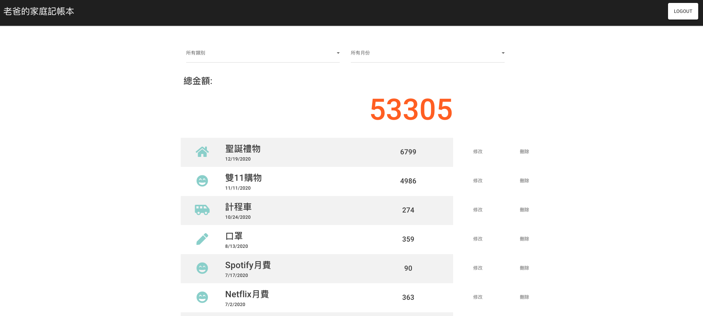

## Expense Tracker
<div align="center">
  
</div>
<br>
<div align="center">

  **[<ins>Browse the website</ins>](https://serene-falls-76664.herokuapp.com/)**

</div>

### Features
1. User can register account or login with Facebook
2. User can manage the expense record by creating, editing and deleting things from the list
3. User can query and sort the record by category and month 
### Setup
Activate MongoDB 

```bash
$ cd ~/mongodb/bin/
$ ./mongod --dbpath ~/mongodb-data
```

Clone the repo and install the dependencies.

```bash
$ git clone https://github.com/r05323045/expense-tracker.git
$ cd exprense-tracker
```
then
```bash
$ npm install
```

To start the express server and use seed data, run the following

```bash
$ npm run seed
$ npm run dev
```

Open [http://localhost:3000](http://localhost:3000) and take a look around.

We have a test user for testing:

| Username      | Email             | Password |
| ------------- |:-----------------:|:--------:|
| 老爸           |root@example.com   | 12345678 |

Have fun!